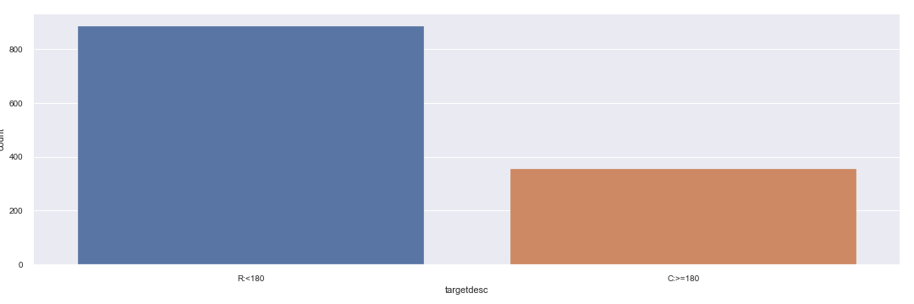
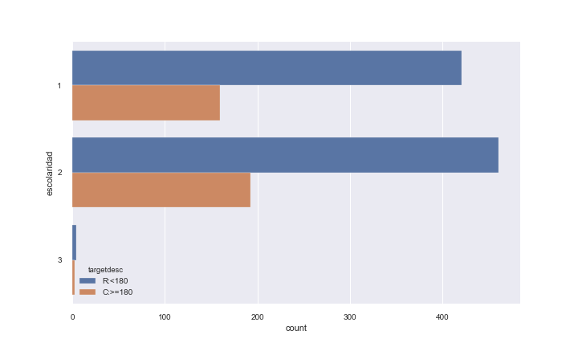
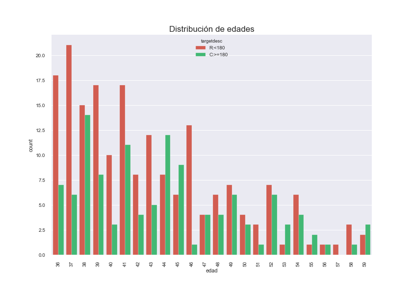
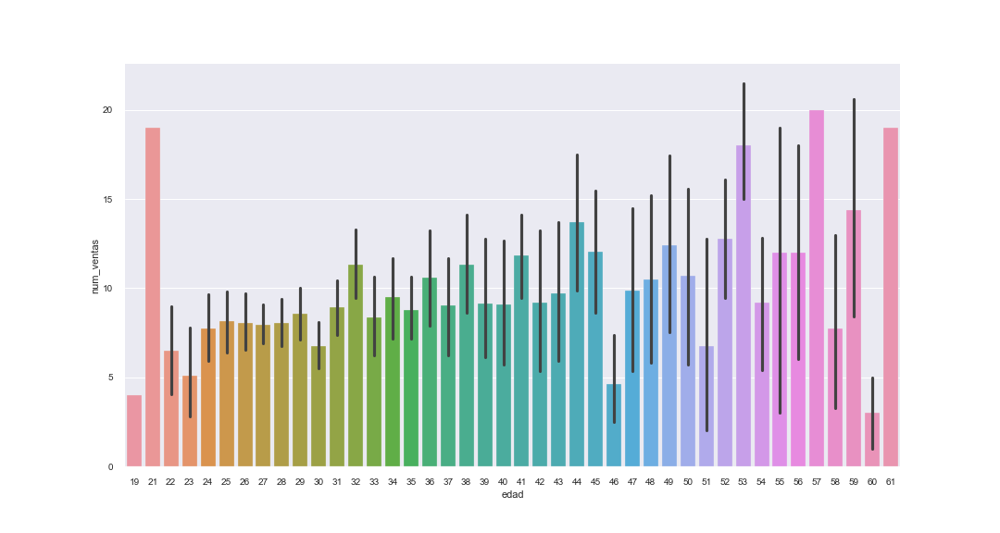
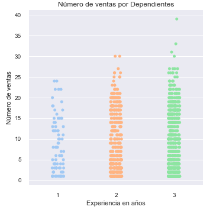
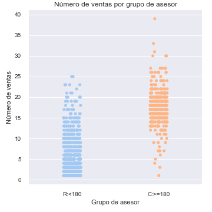
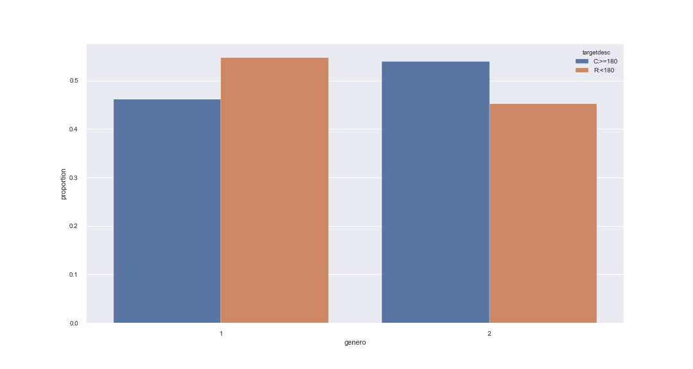
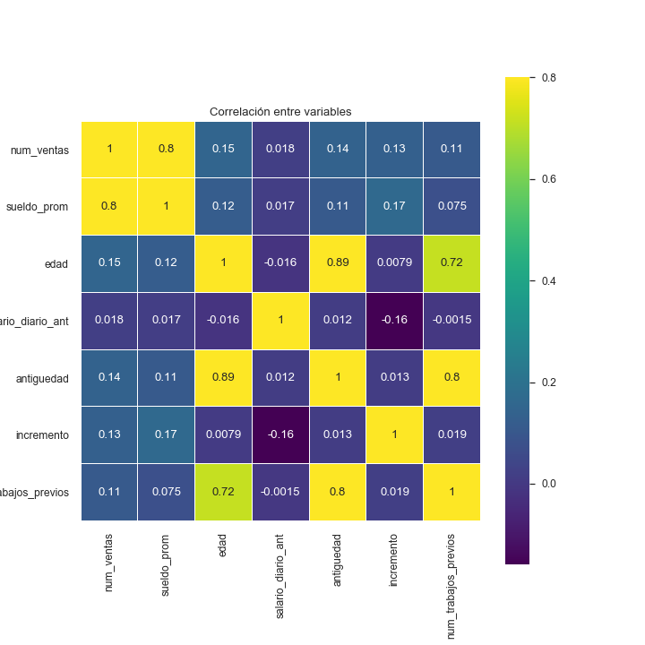

```{r,eval=FALSE,echo=F,message=F,warning=F,error=F,}
rm(list=ls())
paquetes<-c("tidyverse","survival","Hmisc","chron","survminer","lubridate","here","ggridges","ggrepel","xtable","cowplot","magick","grid","gridExtra")
check_packages<-function(x){
  sapply(x,function(y){if(!y%in%rownames(installed.packages())) install.packages(y,quiet=T)})
  sapply(x,require,character.only=T,quietly=T)
}
aux<-check_packages(paquetes)
```


```{r, eval=FALSE, echo=FALSE, warning=FALSE, message=FALSE}
# directorio y carga de librerías 

setwd("~/MCD/Otoño2019/Regresión Avanzada/Proyecto final/")
library(R2OpenBUGS)
library(R2jags)
library(ggplot2)
library(dplyr)
library(tidyr)
library(openxlsx)
library(readxl)

prob<-function(x){
  out<-min(length(x[x>0])/length(x),length(x[x<0])/length(x))
  out
}

```

```{r, eval=FALSE, echo=FALSE}
data <- read.xlsx("TARGET_ROTACION.xlsx")
colnames(data) <- tolower(colnames(data))
data$f_alta <- as.Date(data$f_alta, origin="1899-12-30")
```

#Introducción

## Contexto
Profuturo SA de CV es una institución financiera privada encargada de administrar los fondos de los trabajadores en México para su retiro. Dicha administración se hace a través de cuentas personales que asigna a cada trabajador, en las que se depositan las aportaciones hechas a lo largo de su vida laboral.La empresa tiene presencia a nivel nacional a través de 174 sucursales. 

Todas las Afores están reguladas por la CONSAR (https://www.gob.mx/consar), la Comisión Nacional del Sistema de Ahorro para el Retiro. Esta se encarga de:

    1) Vigilar que tus recursos estén seguros.
    
    2) Supervisar que se inviertan dentro de los parámetros y límites establecidos.
    
    3) Obligar a cada AFORE a una reducción anual de comisiones cobradas a cada cuenta individual.


Basado en el tercer punto, el organismo explicó que existen tres razones por las que las comisiones deben bajar:

    1) Las comisiones afectan de manera adversa el saldo pensionario de mantenerse elevadas por mucho tiempo.
    
    2) Las comisiones en México continúan en un nivel por encima de la práctica internacional de administradores de fondos similares.
    
    3) Los saldos en el SAR seguirán creciendo de manera sostenida por al menos 15 años más por lo que las economías de escala en el Sistema permiten seguir bajando comisiones.


Por tanto, uno de los esfuerzos que busca la AFORE consiste en reducir los gastos asociados a la administración, inversión y operación de cada cuenta, así como reducir los gastos comerciales que están asociados a adquirir nuevos clientes. Entre los gastos comerciales más relevantes:

* Gastos de adquisión de cuentas: Sueldos, bonos y comisiones.

* Gastos de capacitación: Eventos y dinámicas de integración.

* Gastos de licencia: Gastos asociados a exámenes y cursos regulatorios.


Particularmente, una problemática a la que se enfrenta Profuturo SA de CV, repercute en el alto costo relacionado a la adquisición de cuentas nuevas que conlleva reclutar asesores de ventas, capacitarlos así como realizar los pagos de exámenes y licencias para darse de alta frente al organismo regulador. Sin embargo, aunque la inversión es elevada muchos asesores contratados causan baja por diferentes motivos; es decir, después de que se invierte en la capacitación, cursos y exámenes deciden renunciar o abandonar la institución. 


En resumen, toda vez que un nuevo colaborador entra a la empresa, recibe un curso de inducción para familiarizarse con la misión y visión de la compañía y, dependiendo del área, se les da también una capacitación. En e caso del departamento de ventas, la capacitación tiene una duración de 6 meses y los colaboradores tienen interacción con personal de otras sucursales. En algunas ocasiones, una vez terminado el perido de capacitación, el colaborador decide dar por terminada la relación laboral y esto conlleva a un nuevo proceso de reclutamiento e inversión en capacitación. 

Con esto en mento, lo que se busca es conocer de manera anticipada aquellos individuos (asesores de venta) más probables a abandonar la institución a los 6 meses (tiempo que dura la capacitación, el período de exámenes y cursos inductivos) y generar campañas que permitan retener el talento para disminuir la tasa de rotación de personal y los gastos asociados.


## Identificación del problema
1)¿Cuál es el problema?

    El problema radica en una elevada tasa de rotación de asesores de venta, superando una tasa del 50% de rotación anual; es decir, por cada 2 asesores contratados, 1 se va de la compañía antes de cumplir los 6 meses, tiempo que dura la capacitación.
  
2)¿Por qué es un problema?

     La consecuencia es elevados costos de capacitación y desarrollo del equipo encargado de captación de nuevos clientes.

3)¿Para quién es un problema?

    Para Profuturo SA de CV, quién al tener elevados costos de capacitación y desarrollo, puede disminuir su Rentabilidad como resultado de la presión del organismo regulador (CONSAR) al reducir el cobro de comisión a los clientes que tienen una cuenta individual; es decir, se disminuirían los ingresos y se mantendrían los gastos sino se logran disminuir.
    

## Entendimiento de los datos

La base de datos con la que se trabajará está conformada por `nrow(data)` asesores de ventas de la empresa y las variables se describen a continuación: 

+ fecha de alta (F_ALTA): fecha de ingreso a la empresa

+ sexo: sexo del asesor 

+ edad: edad del asesor en años

+ sucursal: sucursal u oficina en la que está asignado el asesor

+ div: división o región a la que pertence la sucursal. Las divisiones son: Metropolitana, Noreste, Norte, Norte/Sureste y Sur. 

+ número de ventas: total de ventas acumuladas en tres meses

+ sueldo promedio: pago por las comisiones generadas según el número de ventas

+ antigüedad: antigüedad laboral. La variable se calcula a partir de la fecha de ingreso al Seguro Social

+ trabajo previos: cantidad de trabajos previos 

+ edo_civil: estado civil del asesor

+ experiencia: experiencia en ventas (sin experiencia, 1 año, 2 años, más de 2 años)

+ escolaridad: nivel de escolaridad del asesor (secundaria, bachillerato, licenciatura, maestría)

+ salario diario anterior: salario anterior del asesor. Para fines de los análisis, la variable se multiplica por un factor=30.4 y se obtiene el salario mensual anterior. 

+ rotación o target: el asesor renunció después de terminar la capacitación o no

## Objetivos

Bajo el contexto antes mencionado, el objetivo del modelo es calcular la probabilidad de que un nuevo asesor de ventas renuncie una vez terminada la capacitación. 

De manera particular, se desarrollarán dos modelos: 

+ modelo lineal generalizado

+ modelo jerárquico

El trabajo se divide en XX secciones: (1) análisis exploratorio de datos en donde se da una breve explicación de las variables así como la representación gráfica de algunas de las variables y relacinoes bivariadas; en la sección *análisis inferencial* se detalla la especificación de los modelos así como los resultados de cada uno de ellos y las variables que resultaron significativas. Finalmente, se presentan las conlcusiones del proyecto. 

# Preparación de los datos

Como el objetivo del análisis fue conocer si las personas que contrataron efectivamente superaron el período de capacitación de 6 meses (180 días); se generó una variable target o variable objetivo con la finalidad de formar grupos de interés.

    1) Grupo C: Aquellos asesores que superaron el período de capacitación de 180 días consolidandose como empleados de la compañía.

    2) Grupo R: Aquellos asesores que no superaron el período de capacitación de 180 días y rotaron a otros empleos o se desemplearon.

Se generó por tanto, una bandera o variable "dummy" donde se asignó el valor de 1 si pertenece al grupo R (grupo de interés por razones de rentabilidad) y el valor de 0 si pertenece al grupo C.

#Análisis Exploratorio de Datos

En este apartado, se reportó una descripción gráfica de los hallazgos encontrados durante el análisis respecto a la variable a predecir. Recordemos que estamos interesados en conocer con anticipación (a los 3 meses de contratación) aquellos asesores de venta contratados que no llegarán a los 180 días. Una parte importante será conocer si algunas variables pueden dar explicación por sí mismas a diferencias entre la variable target. 

Cabe recalcar, que la compañía desea conocer esta información de manera previa, para realizar campañas de retención de talento, por lo que observar de manera gráfica algunos comportamientos permitió generar hipótesis para la sección de estadística inferencial.

Por tanto, resultó importante observar si existen variables que podrían ayudar a encontrar insights que den una sugerencia discriminante acerca de la variable target (si el asesor rota o no). En muchas ocasiones está variable es notoria en cada asesor; sin embargo, para efectos de escalabilidad se otorgó evidencia gráfica y numérica de lo encontrado.

Resulta entonces inmedianto conocer la distibución de asesores que abandonaron el empleo del conjunto de información histórica con la que se realizó el estudio. Dicha distribución pretende dar un panorama global de los 


En el gráfico 1 debajo se muestra información de la distribución de la variable targetdesc, que no es más que una descripción de la variable target para cada uno de los 1242 asesores de estudio. De acuerdo a nuestra variable de interés, se clasifican en los siguientes grupos:

    1) Grupo R: Asesores que rotaron antes de los 6 meses o 180 días, que representan el 71 % del total de asesores.
    
    2) Grupo C: Asesores que lograron consolidarse después de los 6 meses o 180 días, que representaron el 29% del total de asesores.
    
    
La variable target entonces, estará distribuida de la siguiente forma: Grupo R con un 71% y Grupo C con un 29% del total.



Con base en lo anterior, los hallazgos se centraron en encontrar diferencias gráficas (visuales) que puedan ayudar a distinguir entre asesores del grupo R (< 180 días) vs asesores del grupo C (>= 180). 


No obstante, de inicio y conociendo la distribución anterior, se esparaba que cada variable seleccionada tenga más asesores dentro del grupo R que del grupo C; por lo que los hallazgos se centraron en romper este patrón de inicio.


En el siguiente gráfico 2 se observa la escolaridad del asesor de ventas de acuerdo a cada grupo de interés siendo:


Escolaridad 1: Asesores con prepa técnica o bachilletaro.


Escolaridad 2: Asesores con Licenciatura concluida.


Escolaridad 3: Asesores con Maestría.


Sin embargo, prevalecen las condiciones iniciales, para cada grupo existen más asesores del grupo R que del grupo C como se observa a continuación:



Otra de las variables con las que se intentó observar diferencias y cambiar el tipo de patrones diferentes a la distribución original de los grupos fue la variable "edad" que da información acerca de la edad de en el momento de contratación del asesor en la compañía.

Lo que se observa en el gráfico 3 muestra ligeras diferencias entre los grupos R y C en la medida que cambian de edad; es decir, más personas del grupo R (< 180) se concentran en edades tempranas; sin embargo el comportamiento se lograr nivelar a medida de que las edades incrementan, mostrándose un cambio en la frecuencia (por ejemplo, en edades:44 y 45) siendo mayores los del grupo C (>=180).



Por lo anterior, resultó importante estudiar las edades a fondo, en esta ocasión se comparó con el número de ventas realizadas para conocer el impacto de las ventas respecto al incremento de edad.

Lo que se observa en la Figura 4 muestra evidencia de que existe una tendencia clara, de que a partir de los 31 años en adelante (exceptuando los 21 años) los asesores logran llegar a más de 10 ventas en sus primeros 3 meses en la compañía con más facilidad; no obstante, aún hay quienes no logran superar esta barrera, pero se rescató la relevancia e impacto que tienen las ventas en la decisión de rotar o permenecer en un área de ventas, lo cuál parece que tiene mucho sentido. Por tanto, se compararán en los aiguientes gráficos el número de ventas para poder observar más hallazgos.



En consecuencia, se decidió observar el comportamiento de las ventas de acuerdo a la experiencia en años del asesor, aunado a que si las ventas dan un indicio de que un asesor pueda rotar o no, alguien con experiencia puede tener más facilidades de convencimiento en ventas que una persona sin experiencia.

En el gráfico 5 se observa este comparativo mostrándo algunos asesores con un mejor número de ventas en la medida que su experiencia en ventas es de más tiempo. Posiblemente a la compañía le convenga establecer un límite de experiencia en años en el momento de la contratación para disminuir la tasa de rotación.



Finalmente, se observa una diferencia contundente en el gráfico 6 donde se muestra que el número de ventas tiene un impacto en la rotación de asesores. Es decir, el grupo que se consolida promedia ventas superiores a 10, mientras que los asesores que rotan promedian por debajo de las 10 ventas en sus primeros 3 meses. Lo relevante para la compañía será poder llevar acciones concretas para lograr que los asesores hagan más de 10 ventas en sus primeros 3 meses.



Por otro lado, a la compañía le interesó conocer las distribución por genero para cada grupo de asesores , lo cuál se muestra en la Figura 7. Lo relevante es que muestra una diferencia entre hombre y mujeres en la tasa de rotación, ya que se observa que los hombres tienen menores niveles de rotación que las mujeres. No obstante, se validará si realmente existe una diferencia más adelante con un modelo jerárquico por género, y también se especificarán las implicaciones éticas de generar este tipo de categorías.



Adicionalmente se calculó una matriz de correlaciones lineales para variables "NUMÉRICAS" y tener mejores insights de cuáles pueden ser útiles en la modelación y predicción de asesores que rotan de la compañía. La matriz de correlación se muestra en el gráfico 7:




#Análisis inferencial 

## Definición de los modelos

Como se menciona en la sección del análisis exploratorio de los datos, resulta de interés conocer las variables que tienen un efecto en la baja voluntaria de los asesores de ventas. 

Si consideramos la baja voluntaria del asesor como \{1=renuncia, 0=permanece\}, podemos decir que la variable de interés sigue una distribución Bernoulli. Si quisiéramos considerar a la variable como la tasa de rotación, podríamos pensar en una distribución beta para la variable de interés. En este último caso, necesitaríamos calcular el número de bajas y el total de asesores expuestos bajo algún criterio. 

Para considerar los datos de manera desagregada, definimos a la variable $Y_i|\pi_i\sim Be(\pi_i)$; es decir,


\begin{equation}
  Y_i|\pi_i =
    \begin{cases}
      1 & \text{si el asesor renuncia después de la capacitación}\\
      0 & \text{si el asesor permance después de la capacitación}\\
\end{cases}       
\end{equation}

Consideraramos las siguientes ligas:

+ liga logística: $$\pi_i=\frac{e^{X'_i}\beta}{1+e^{X'_i}\beta}$$

+ liga normal: $$\pi_i=\phi(X'_i\beta)$$

+ liga log log complementaria: $$\pi_i=1-e^{-e^{X'_i\beta}}$$

En cualquiera de los casos anteriores, definimos $\eta_i=X'_i\beta$

Usando la información anterior, se realizarán 3 modelos: 1. un modelo simple con controles, 2. un modelo simple con controles e interacciones y 3. un modelo jerárquico.

### 1.Modelo simple con controles

$$\eta_i=\alpha+\beta_1*sueldo.prom_iedad_i+\beta_2*sueldo.men.ant_i + \beta_3*incremento_i + \beta_4*antiguedad_i + \beta_5*tprevios\\+\beta_6*nventas_i +\beta_7*edad_i+\delta1_{z1i} + \delta2_{z2i} + \delta3_{z3i} + \delta4_{z4i}+\delta5_{z5i}+\delta6_{z6i}+\delta7_{z7i}+\epsilon_i$$

en donde

+ $z_{1i}$ división: $z_{1i} \in \{1,2\}$

+ $z_{2i}$ mes: $z_{2i} \in \{1,...,6\}$

+ $z_{3i}$ sexo del asesor: $z_{3i} \in \{1,2\}$

+ $z_{4i}$ estado civil: $z_{4i} \in \{1,2\}$

+ $z_{5i}$ dependientes: $z_{5i} \in \{1,2,3\}$

+ $z_{6i}$ escolaridad: $z_{6i} \in \{1,2,3\}$

+ $z_{7i}$ experiencia: $z_{7i} \in \{1,2,3\}$

### 2.Modelo simple con controles e interacciones

$$\eta_i=\alpha+\beta_1*sueldo.prom_iedad_i+\beta_2*sueldo.men.ant_i + \beta_3*incremento_i + \beta_4*antiguedad_i + \beta_5*tprevios\\+\beta_6*nventas_i +\beta_7*edad_i+\delta1_{z1i} + \delta2_{z2i} + \delta3_{z3i} + \delta4_{z4i}+\delta5_{z5i}+\delta6_{z6i}+\delta7_{z7i}+ \nu1_{z8i*z9i}+\epsilon_i$$

en donde

+ $z_{8i}$ edad_cat: $z_{8i} \in \{1,2,3\}$

+ $z_{9i}$ sueldo_promedio_cat: $z_{9i} \in \{1,2,3\}$

Al tener variables explicativas categóricas, impondremos restricciones de estimabilidad sobre algunos parámetros: 

$$\sum_{i=1}^{2} \delta1 = \sum_{i=1}^{6} \delta2 = \sum_{i=1}^{2} \delta3 = \sum_{i=1}^{2} \delta4 = \sum_{i=1}^{3}  \delta5 = \sum_{i=1}^{3}  \delta6 = \sum_{i=1}^{3} \delta7 = \sum_{i=1}^{}\sum_{j=1}^{}\nu1_{ij}=0 $$

## Estimación de los modelos

Para estimar los modelos, definimos el número de iteraciones y cadenas a correr, el perioro de calentamiento y el adelgazamineto de las cadenas. Además, para que el intercepto tuviera una interpretación correcta, escalamos las variables numéricas. No es necesario centrar las variables categóricas pues se centran al imponer las restricciones de estimabilidad definidas anteriormente.

-**Iteraciones:** Se corrieron 50,000 iteraciones para asegurar que las estimaciones de los coeficientes variaran lo menos posible si se calculaba nuevamente el modelo. Con menos iteraciones, había variación en las estimaciones del modelo. 

-**Cadenas:** Se corrieron dos cadenas para asegurar que la convergencia fuera correcta y que no se haya atorado alguna cadena en alguna región inusual del espacio de parámetros. 

-**Periodo de calentamiento:** Se tiraron las primeras 5,000 iteraciones (10% de las iteraciones en total), pues nos interesa el valor de convergencia y así disminuimos la probabilidad de que las iteraciones se encuentren influenciadas por el valor inicial especificado.

-**Adelgazamiento:** Se utilizó un adelgazamiento de 1 para reducir la correlación entre iteraciones consecutivas.

#Resultados

Los valores del criterio de información de devianza (DIC) para los 9 modelos: 3 simples, 3 con interacciones y 3 jerárquicos son los siguientes:

| Liga     | DIC simple | DIC interacciones | DIC jerárquico |
|----------|------------|-------------------|----------------|
| logit    | 611.2663   |    629.725        |                |
| probit   | 620.1496   |    636.8094       |                |
| clog log | 627.9551   |    619.7625       |                |

De los 3 modelos simples estimados, el que tuvo mejor ajuste de acuerdo con el DIC fue el modelo con la liga logística. Para los modelos con interacciones, el mejor modelo fue el de la liga cloglog. Y, para los modelos jerárquicos, es el modelo....

### 1.Modelo simple con controles

El resultado del modelo simple con controles con liga logística se muestra a continuación:

|  Variables                   | Media    | Desviación estándar | Límite inferior | Límite superior | Significativa |
|------------------------------|----------|---------------------|-----------------|-----------------|---------------|
| Constante                    | -1.4732  | 5.7006              | -12.6980        | 9.7265          |               |
| Devianza                     | 587.2223 | 6.9345              | 575.8497        | 602.5498        |               |
|    **Información laboral**   |          |                     |                 |                 |               |
| Sueldo promedio              | -0.4163  | 0.1681              | -0.7493         | -0.0916         | *             |
| Suledo mensual anterior      | 0.1015   | 0.1127              | -0.1188         | 0.3237          |               |
| Incremento en sueldo         | -0.1141  | 0.1287              | -0.4163         | 0.0884          |               |
| Antigüedad                   | 0.3068   | 0.2911              | -0.2635         | 0.8761          |               |
| Número de trabajos previos   | 0.3365   | 0.1765              | -0.0064         | 0.6851          |               |
| Número de ventas             | -3.0174  | 0.2299              | -3.4809         | -2.5793         | *             |
|     *División territorial*     |          |                     |                 |                 |               |
| Norte                        | -0.1518  | 0.1470              | -0.4391         | 0.1368          |               |
| Sur                          | 0.1518   | 0.1470              | -0.1368         | 0.4391          |               |
|          *Mes de alta*         |          |                     |                 |                 |               |
| Julio                        | 0.3794   | 0.5195              | -0.6242         | 1.4117          |               |
| Agosto                       | 0.2290   | 0.2170              | -0.1959         | 0.6568          |               |
| Septiembre                   | 0.6671   | 0.2908              | 0.0994          | 1.2388          | *             |
| Octubre                      | -0.4513  | 0.2716              | -0.9855         | 0.0790          |               |
| Noviembre                    | -0.4439  | 0.2567              | -0.9518         | 0.0575          |               |
| Diciembre                    | -0.3802  | 0.2837              | -0.9361         | 0.1760          |               |
| **Información personal**     |          |                     |                 |                 |               |
| Edad                         | -0.7205  | 0.2536              | -1.2192         | -0.2269         | *             |
|             *Sexo*             |          |                     |                 |                 |               |
| Masculino                    | 0.2997   | 0.1153              | 0.0761          | 0.5283          | *             |
| Femenino                     | -0.2997  | 0.1153              | -0.5283         | -0.0761         | *             |
|         *Estado civil*         |          |                     |                 |                 |               |
| Casado                       | 0.0980   | 0.1597              | -0.2143         | 0.4109          |               |
| Soltero                      | -0.0980  | 0.1597              | -0.4109         | 0.2143          |               |
|    *Dependientes económicos*   |          |                     |                 |                 |               |
| Con hijos                    | 0.1239   | 0.2190              | -0.3032         | 0.5540          |               |
| Sin hijos                    | -0.2707  | 0.1909              | -0.6435         | 0.1059          |               |
| Otros                        | 0.1468   | 0.2316              | -0.3071         | 0.6013          |               |
|          *Escolaridad*         |          |                     |                 |                 |               |
| Bachillerato/carrera técnica | 0.2266   | 0.4369              | -0.6426         | 1.0710          |               |
| Licenciatura                 | 0.4081   | 0.4278              | -0.4428         | 1.2339          |               |
| Maestría                     | -0.6347  | 0.8329              | -2.2360         | 1.0245          |               |
|          *Experiencia*         |          |                     |                 |                 |               |
| Sin experiencia              | 0.0289   | 0.3128              | -0.5778         | 0.6500          |               |
| 1 año                        | 0.1257   | 0.2126              | -0.2941         | 0.5401          |               |
| 2 años o más                 | -0.1547  | 0.2379              | -0.6212         | 0.3097          |               |

Las variables significativas del modelo son:

+ El sueldo promedio: Caeteris paribus, ante un aumento de una unidad en el sueldo promedio, la razón de momios disminuye en 34%.

+ El número de ventas: Caeteris paribus, al aumentar en una unidad el número de ventas, la razón de momios disminuyen en 95%.

+ Darse de alta en septiembre: Caeteris paribus, darse de alta en septiembre aumenta la razón de momios en 95%.

+ La edad: Caeteris paribus, aumentar la edad en una unidad disminuye en 51% la razón de momios.

+ El sexo: Caeteris paribus, ser hombre aumenta en 35% la razón de momios mientras que ser mujer la disminuye en 26%.

### 2.Modelo simple con controles e interacciones

El resultado del modelo con interaccoines y liga cloglog se muestra a continuación:

| Variables                       | Media    | Desviación estándar | Límite inferior | Límite superior | Significativa |
|---------------------------------|----------|---------------------|-----------------|-----------------|---------------|
| Constante                       | -4.4648  | 4.1003              | -11.5675        | 4.2955          |               |
| Devianza                        | 590.7545 | 7.4514              | 578.1950        | 607.2148        |               |
| **Información laboral**             |          |                     |                 |                 |               |
| *Sueldo promedio*                 |          |                     |                 |                 |               |
| <2000                           | 1.8014   | 1.6716              | -0.3501         | 5.8659          |               |
| 2000<sueldo<10000               | -0.5265  | 0.8517              | -2.5653         | 0.6260          |               |
| >10000                          | -1.2750  | 0.8809              | -3.3629         | -0.0197         | *             |
| Suledo mensual anterior         | 0.0257   | 0.0671              | -0.1079         | 0.1557          |               |
| Incremento en sueldo            | -0.1138  | 0.1091              | -0.3725         | 0.0469          |               |
| Antigüedad                      | -0.0430  | 0.1324              | -0.3048         | 0.2144          |               |
| Número de trabajos previos      | 0.0905   | 0.1007              | -0.1074         | 0.2873          |               |
| Número de ventas                | -2.0743  | 0.1506              | -2.3799         | -1.7883         | *             |
| *División territorial*            |          |                     |                 |                 |               |
| Norte                           | -0.2004  | 0.0862              | -0.3699         | -0.0328         | *             |
| Sur                             | 0.2004   | 0.0862              | 0.0328          | 0.3699          | *             |
| *Mes de alta*                     |          |                     |                 |                 |               |
| Julio                           | 0.1681   | 0.2757              | -0.3634         | 0.7165          |               |
| Agosto                          | 0.0817   | 0.1255              | -0.1675         | 0.3257          |               |
| Septiembre                      | 0.2629   | 0.1730              | -0.0794         | 0.5992          |               |
| Octubre                         | -0.2366  | 0.1460              | -0.5252         | 0.0495          |               |
| Noviembre                       | -0.1582  | 0.1448              | -0.4430         | 0.1250          |               |
| Diciembre                       | -0.1178  | 0.1683              | -0.4502         | 0.2092          |               |
| **Información personal**            |          |                     |                 |                 |               |
| *Edad*                            |          |                     |                 |                 |               |
| <30                             | -0.6163  | 0.8627              | -2.6676         | 0.5904          |               |
| 30<edad<50                      | -0.9881  | 0.8517              | -3.0310         | 0.1591          |               |
| >50                             | 1.6044   | 1.7025              | -0.6922         | 5.6903          |               |
| *Sexo*                            |          |                     |                 |                 |               |
| Masculino                       | 0.0627   | 0.0657              | -0.0672         | 0.1908          |               |
| Femenino                        | -0.0627  | 0.0657              | -0.1908         | 0.0672          |               |
| *Estado civil^*                    |          |                     |                 |                 |               |
| Casado                          | 0.1211   | 0.0943              | -0.0622         | 0.3067          |               |
| Soltero                         | -0.1211  | 0.0943              | -0.3067         | 0.0622          |               |
| *Dependientes económicos*         |          |                     |                 |                 |               |
| Con hijos                       | 0.0787   | 0.1266              | -0.1696         | 0.3253          |               |
| Sin hijos                       | -0.2435  | 0.1107              | -0.4622         | -0.0283         | *             |
| Otros                           | 0.1648   | 0.1319              | -0.0909         | 0.4252          |               |
| *Escolaridad*                     |          |                     |                 |                 |               |
| Bachillerato/carrera técnica    | 0.2583   | 0.2625              | -0.2336         | 0.7905          |               |
| Licenciatura                    | 0.1709   | 0.2602              | -0.3203         | 0.6969          |               |
| Maestría                        | -0.4292  | 0.5055              | -1.4576         | 0.5168          |               |
| *Experiencia*                     |          |                     |                 |                 |               |
| Sin experiencia                 | 0.1288   | 0.1831              | -0.2271         | 0.4880          |               |
| 1 año                           | -0.1543  | 0.1249              | -0.3989         | 0.0911          |               |
| 2 años o más                    | 0.0256   | 0.1378              | -0.2451         | 0.2941          |               |
| **Interacciones**                   |          |                     |                 |                 |               |
| Edad <30 y sueldo <2000         | -2.0149  | 1.6705              | -6.0653         | 0.1251          |               |
| 30<edad<50 y sueldo <2000       | -2.3692  | 1.6703              | -6.4173         | -0.2338         | *             |
| Edad >50 y sueldo <2000         | 4.3841   | 3.3321              | 0.1593          | 12.4773         | *             |
| Edad <30 y 2000<sueldo <10000   | 0.8189   | 0.8557              | -0.3546         | 2.8725          |               |
| 30<edad<50 y 2000<sueldo <10000 | 0.9509   | 0.8544              | -0.2156         | 3.0010          |               |
| Edad >50 y 2000<sueldo <10000   | -1.7698  | 1.6991              | -5.8651         | 0.5109          |               |
| Edad <30 y sueldo >10000        | 1.1960   | 0.8827              | -0.0708         | 3.2867          |               |
| 30<edad<50 y sueldo >10000      | 1.4183   | 0.8839              | 0.1564          | 3.5113          | *             |
| Edad >50 y sueldo >10000        | -2.6143  | 1.7452              | -6.7602         | -0.1761         | *             |

Las variables significativas del modelo son:

+ Tener un sueldo >1000: Caeteris paribus, tener un sueldo promedio mayor a $10000 disminuye el momio en 0.2794.

+ Número de ventas: Caeteris paribus, al aumentar en una unidad el número de ventas, el momio disminuye en 0.1256.

+ División territorial: Trabajar en el norte disminuye el momio en 0.8184
 mientras que, trabajar en el sur lo aumenta en 1.2219.
 
+ No tener hijos: No tener hijos disminuye el momio en 0.7839.

+ Tener entre 30 y 50 años y un sueldo menor a 2000: Tener entre 30 y 50 años y un sueldo menor a $2000 disminuye el momio en 0.0936.

+ Tener más de 50 años y un sueldo menor a 2000: Tener más 50 años y un sueldo menor a $2000 aumenta el momio en 80.1665.

+ Tener entre 30 y 50 años y un sueldo mayor a 10000: Tener entre 30 y 50 años y un sueldo mayor a $10000 aumenta el momio en 4.1300.

+ Tener más de 50 años y un sueldo mayor a 10000: Tener más de 50 años y un sueldo mayor a $10000 disminuye el momio en 0.0732.

Los efectos de las interacciones pueden observarse en las siguientes gráficas:

|Interacción del efecto de tener un sueldo bajo y la edad|  
|-------------------------------------------------|
| | 

|Interacción del efecto de tener un sueldo medio y la edad|  
|-------------------------------------------------|
| | 

|nteracción del efecto de tener un sueldo alto y la edad|  
|-------------------------------------------------|
| | 

### 3.Modelo jerárquico

El resultado del modelo con interaccoines y liga cloglog se muestra a continuación:


Las variables significativas del modelo son:

#Conclusiones

#Bibliografía

#Anexo

En la siguiente sección se muestra el código utilizado tanto para realizar el análisis exploratorio de los datos como para el desarrollo de los modelos. 

